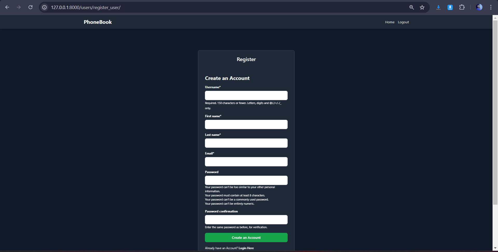
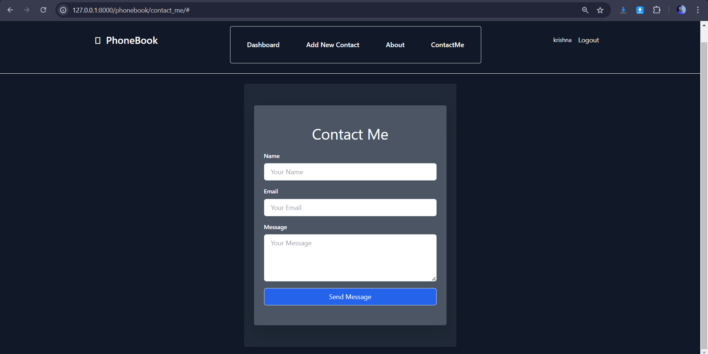

# Phonebook Web Application

## Overview

The Phonebook Web Application is a Django-based project designed to help users manage their contacts efficiently and securely. With a user-friendly interface built using Tailwind CSS and Bootstrap, this application provides a seamless experience for users to store, edit, and view their contact information. Each user has a private space, ensuring that personal data remains confidential and secure.

---

## Features

* **User Authentication** – Secure login system allowing users to create accounts and access their personal contact list.
* **Add Contacts** – Save new contacts with name, phone number, email, and address.
* **Edit Contacts** – Update existing contact details anytime.
* **View Contacts** – Access a detailed list of all saved contacts.
* **Responsive Design** – Built with Tailwind CSS and Bootstrap for all screen sizes.
* **Privacy** – Users can only manage their own contacts.
* **Phone Number Handling** – Uses `phonenumber_field` for standardized phone number storage.

---

## Technologies Used

* **Django** – Python web framework for rapid development.
* **HTML/CSS** – For structure and design.
* **Tailwind CSS** – Utility-first CSS framework.
* **Bootstrap** – Responsive front-end toolkit.
* **SQLite** – Lightweight database for local development.
* **phonenumber_field** – For phone number validation and storage.
* **Crispy Forms** – For improved form rendering.
* **Docker** – Used for containerization and CI/CD pipeline setup.

---

## Installation

### Prerequisites

* Python 3.12
* Django
* Pip (Python package installer)
* Docker *(optional, for containerized setup)*

---

### Steps

1. **Clone the repository:**

   ```bash
   git clone https://github.com/yourusername/phonebook-web-app.git
   cd phonebook-web-app
   ```

2. **Install dependencies:**
   Make sure you are inside an activated virtual environment, then install dependencies:

   ```bash
   pip install -r requirements.txt
   ```

3. **Create Migrations:**
   Generate migration files for your Django models:

   ```bash
   python manage.py makemigrations
   ```

4. **Apply Migrations:**
   Apply the generated migrations to set up your database:

   ```bash
   python manage.py migrate
   ```

5. **Create a Superuser (optional):**
   To access the Django admin panel:

   ```bash
   python manage.py createsuperuser
   ```

6. **Run the Development Server:**
   Start the application locally:

   ```bash
   python manage.py runserver
   ```

7. **Access the Application:**

   * App: [http://127.0.0.1:8000/](http://127.0.0.1:8000/)
   * Admin Panel: [http://127.0.0.1:8000/admin/](http://127.0.0.1:8000/admin/)

---

## Docker & CI/CD Configuration

The project supports **Docker integration** for easy deployment and CI/CD pipeline automation.

### Docker Setup

1. **Build the Docker Image:**

   ```bash
   docker build -t phonebook-app .
   ```

2. **Run the Docker Container:**

   ```bash
   docker run -d -p 8000:8000 phonebook-app
   ```

3. **View Running Containers:**

   ```bash
   docker ps
   ```

4. **Stop the Container:**

   ```bash
   docker stop <container_id>
   ```

### CI/CD Integration

* Docker ensures **consistent builds** and **isolated environments** across all deployment stages.
* You can easily integrate this setup with platforms like **GitHub Actions**, **GitLab CI**, or **Jenkins** for automated testing and deployment.
* During CI/CD execution, migrations should also be run automatically using:

  ```bash
  python manage.py makemigrations && python manage.py migrate
  ```

---

## Usage

1. **Register an account** to create your personal contact list.
2. **Log in** to access and manage your contacts.
3. **Add, edit, and view** your saved contacts using the intuitive dashboard.

---

## Screenshots

Include your screenshots here to showcase the application.

* 
* 
* 
* 
* 
* 
* 
* 
* 

---

## Contributing

Contributions are welcome! Please fork the repository and submit a pull request with your improvements.

---

## License

This project is licensed under the **MIT License**. See the [LICENSE](LICENSE) file for details.

---

## Acknowledgements

* [Django Documentation](https://docs.djangoproject.com/en/stable/)
* [Tailwind CSS Documentation](https://tailwindcss.com/docs)
* [Bootstrap Documentation](https://getbootstrap.com/docs/)
* [phonenumber_field Documentation](https://github.com/stefanstoeckl/django-phonenumber-field)
* [Django Crispy Forms Documentation](https://django-crispy-forms.readthedocs.io/en/latest/)
* Online tutorials and community resources for guidance and best practices.

