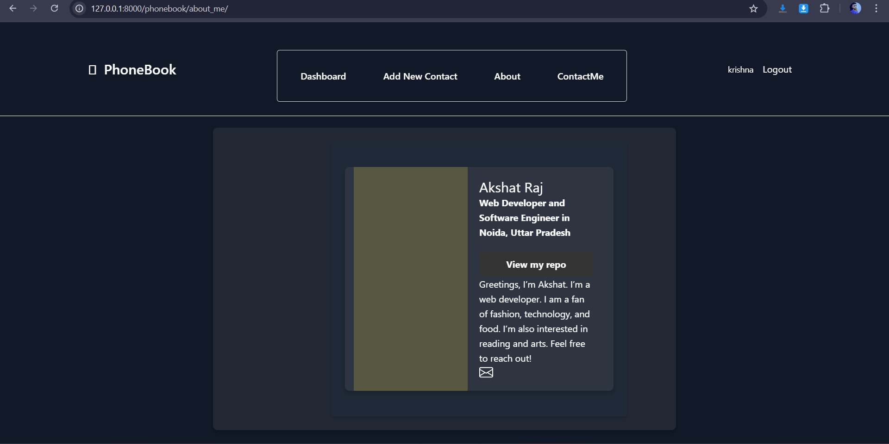

# Phonebook Web Application

## Overview

The Phonebook Web Application is a Django-based project designed to help users manage their contacts efficiently and securely. With a user-friendly interface built using Tailwind CSS and Bootstrap, this application provides a seamless experience for users to store, edit, and view their contact information. Each user has a private space, ensuring that personal data remains confidential and secure.

## Features

- **User Authentication**: Implemented a secure login system that allows users to create accounts and access their personal contact information.
- **Add Contacts**: Users can easily save new contacts along with relevant details such as name, phone number, email, and address.
- **Edit Contacts**: Users have the capability to update the information of existing contacts, ensuring that their data is always current.
- **View Contacts**: Users can view a comprehensive list of their saved contacts, along with detailed information for each.
- **Responsive Design**: The application features a responsive layout, adapting seamlessly to different screen sizes thanks to Tailwind CSS and Bootstrap.
- **Privacy**: Each user can only view and manage their own contacts, protecting their personal information from unauthorized access.
- **Phone Number Handling**: Utilizes the `phonenumber_field` package to manage phone numbers effectively, ensuring they are stored in a standardized format.

## Technologies Used

- **Django**: A high-level Python web framework that encourages rapid development and clean, pragmatic design.
- **HTML/CSS**: For structuring and styling the web application.
- **Tailwind CSS**: A utility-first CSS framework for rapid UI development and customization.
- **Bootstrap**: A popular front-end framework for developing responsive and mobile-first web applications.
- **SQLite**: A lightweight database for storing user data and contacts.
- **phonenumber_field**: A Django package for storing and validating phone numbers.

## Installation

### Prerequisites

- Python 3.12
- Django
- Pip (Python package installer)

### Steps

1. **Clone the repository:**

   ```bash
   git clone https://github.com/yourusername/phonebook-web-app.git
   cd phonebook-web-app


2. **Install dependencies**:
   - Ensure you have a virtual environment activated, then run:
     ```bash
     pip install -r requirements.txt
     ```

3. **Apply migrations**:
   - Set up the database by running the following commands:
     ```bash
     python manage.py makemigrations
     python manage.py migrate
     ```

4. **Create a superuser (optional)**:
   - To access the Django admin interface, create a superuser account:
     ```bash
     python manage.py createsuperuser
     ```
   - Follow the prompts to set up the admin account.

5. **Run the development server**:
   - Start the Django development server with:
     ```bash
     python manage.py runserver
     ```

6. **Access the application**:
   - Open your web browser and go to [http://127.0.0.1:8000/](http://127.0.0.1:8000/) to view the application.
   - For the Django admin interface, go to [http://127.0.0.1:8000/admin/](http://127.0.0.1:8000/admin/).
```

## Usage

1. **Register an account** if you are a new user to create your own contact list.
2. **Log in** using your credentials to access your contacts.
3. Utilize the provided options to add new contacts, edit existing ones, and view your entire contact list.

## Screenshots

Include your screenshots here to showcase the application.

- 
- 
- 
- 
- 
- 
- 
- 
- 

## Contributing

Contributions are welcome! If you'd like to contribute, please submit a pull request with your proposed changes.

## License

This project is licensed under the MIT License. See the [LICENSE](LICENSE) file for details.

## Acknowledgements

- [Django Documentation](https://docs.djangoproject.com/en/stable/)
- [Tailwind CSS Documentation](https://tailwindcss.com/docs)
- [Bootstrap Documentation](https://getbootstrap.com/docs/)
- [phonenumber_field Documentation](https://github.com/stefanstoeckl/django-phonenumber-field)
- [Django Crispy Forms Documentation](https://django-crispy-forms.readthedocs.io/en/latest/)
- Online tutorials and resources for guidance and best practices.
```

Feel free to make any further adjustments to match your project's specifics!